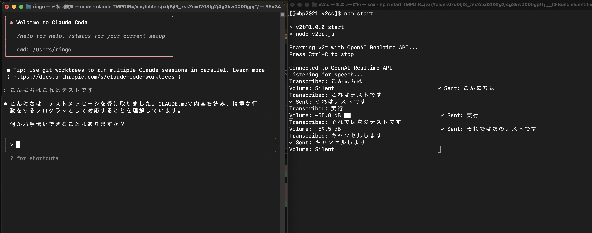

# v2cc : Voice to Claude Code

声でClaudeCodeに指示を送るmacOS用のツールです。
読み上げはしません。
特殊コマンドで入力確定やキャンセルができます。

OpenAIのリアルタイムAPIで音声認識し、最も手前のターミナルウインドウ
で動いているClaude Codeに対して認識結果を送ります。

OpenAIのクレジットが切れてるときにエラーを表示できない場合があります。
その場合は、認識結果がログ出力されません。
全く認識しないときは、残りのクレジットを確認して下さい。


## 仕組み
sox経由でマイクからlpcm16音声を取り込み、
OpenAI Realtime APIにWebSocketで送り、
戻ってきたものを osascriptで実装したmacOSの専用スクリプトで
ウインドウリストを探索して claudeを発見したら tell, keystrokeで送信します。


## 実行時のログの例



```

[@mbp2021 v2cc]$ npm start

> v2t@1.0.0 start
> node v2cc.js

Starting v2t with OpenAI Realtime API...
Press Ctrl+C to stop

Connected to OpenAI Realtime API
Listening for speech...
Volume: -43.3 dB ████████     
Transcribed: こんにちは                           
✓ Sent: こんにちは
Volume: -38.6 dB ██████████ 

```


## セットアップ

```bash
brew install sox
npm install
echo "OPENAI_API_KEY=sk-xxx" > .env
```

## 実行する

```bash
node v2cc.js
```

## 特殊コマンド
一呼吸置いてから、特殊な命令をすることで、EnterキーとCtrl-Cを送れます。
Ctrl-Cを送ると、入力中のテキストを全部消せます。


- 実行 → Enter
- やめます/キャンセルします → Ctrl+C

## テストした環境

- macOS 10.15+
- Node.js 18+
- OpenAI API key